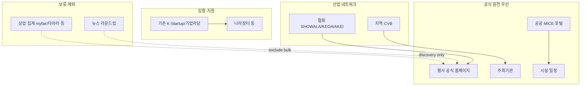

# MICE 소스 전체 지도 및 구현 우선순위

기준일: 2026-07-15  
레지스트리(기준 데이터): `config/mice-source-registry.yaml` — MICE 소스 정보의 **유일한 기준 데이터(source of truth)**  
감사표(생성 산출물): `reports/mice-source-audit.csv` — `scripts/build_mice_source_registry.py`가 YAML을 읽어 검증·생성한 산출물(수동 편집 금지)  
정책: `docs/mice-source-audit-policy.md`  
기존 3사이트 감사(유지): `docs/mice-source-feasibility-audit.md`

## 1. 조사 목적

QRPick·쇼다가 **제안·입찰·영업**할 수 있는 국내 MICE 정보 소스를 체계적으로 확대 발굴하고,  
실제 크롤러 구현 **전에** 소스 레지스트리·수집성·사업가치·연락정보 가능성을 확정한다.  
이번 단계는 대량 크롤러 구현이 아니다.

## 2. 기존 3사이트 감사 인수 결과

| 항목 | 내용 |
|---|---|
| 기준 문서 | `docs/mice-source-feasibility-audit.md` (조사일 2026-07-15) |
| 로컬 샘플 | `logs/mice-feasibility-audit/` (gitignore, 삭제하지 않음·덮어쓰지 않음) |
| 재수집 | robots/sitemap/약관 **재요청하지 않음** |
| 등급 인수 | mice.or.kr **A**, k-mice **A**, myfair **C** (기존 문서 유지) |

레지스트리 매핑(덮어쓰기 아님, 필드 분화):

| source_id | 기존 종합 | technical | legal_operational | business | priority | audit_status |
|---|---|---|---|---|---|---|
| mice_or_kr | A | A | B(약관 복제제한) | B | P0 | INHERITED_EXISTING_AUDIT |
| k_mice | A | A | B(KTO 저작권·예의적 수집) | A | P0 | INHERITED_EXISTING_AUDIT |
| myfair | C | B(Next HTML) | C | C | HOLD | INHERITED_EXISTING_AUDIT |

누락 보완만: legal/business/priority 필드를 기존 근거로 채움. **기존 A/A/C 종합 판정은 변경하지 않음.**

충돌: 없음. 기존 문서의 “구현 시 POST는 B 검증”은 k_mice `notes`에만 기록(기술적 A 유지).

## 3. 전체 MICE 소스 지도

이번 레지스트리 **38개** 소스.

## 4. 소스 범주별 후보

| 범주 | 수 | 대표 |
|---|---:|---|
| VENUE | 12 | KINTEX, COEX, BEXCO*, Songdo, CECO, KDJ, ICC JEJU, EXCO, DCC… |
| REGIONAL_CVB | 8 | 서울CVB, 부산CVB, 인천CVB, 대전CVB, 제주CVB(PENDING)… |
| ASSOCIATION | 5 | SHOWALA, AKEI, KEOA, 한국MICE협회, KAPCO(PENDING) |
| NATIONAL_PUBLIC_MICE | 4 | K-MICE, 마이스워크넷, KINTEX 공공데이터, CVB 디렉터리 |
| PROCUREMENT | 3 | G2B, K-Startup, 기업마당 계열(기존 파이프라인) |
| COMMERCIAL_PLATFORM | 3 | myfair(HOLD), 다아라(HOLD), 콘텐츄어(HOLD) |
| ORGANIZER_EXPORT | 1 | KOTRA GEP |
| MEDIA | 2 | 마이스투데이(EXCLUDE), 뉴스와이어(EXCLUDE) |

\*BEXCO는 HTML 일정은 풍부하나 robots `Disallow:/` → **HOLD**

## 5. P0 수집 후보

레지스트리 `implementation_priority=P0` (12):

1. **k_mice** — 전국 MICE 캘린더, 주최·공식사이트 필드  
2. **mice_or_kr** — 행사정보 + 지원사업 공고  
3. **opendata_kintex_gg** — 공공데이터 CSV(주최·연락·홈페이지 메타)  
4. **kintex** — `/web/ko/event/clist.do` SSR  
5. **songdo_convenia** — 행사 OpenAPI(키 발급 후)  
6. **coex** — 시설 일정(목록 URL 어댑터 보완)  
7. **showala** — AKEI 전시 포털(발견 → 공식 URL 재확인)  
8. **keoa** — 입찰/주최사 네트워크  
9. **mice_seoul_cvb** — 서울 MICE 지원·모집 공고(XHR 검증 필요)  
10. **g2b** — 나라장터(기존 파이프라인 키워드 브리지)  
11. **pipeline_kstartup** — 기존 수집기  
12. **pipeline_bizinfo_sources** — 기존 sources 수집기  

## 6. P1 보완 후보

지역·시설·협회 보완: EXCO, DCC, ICC JEJU, KDJ, CECO, aT센터, 부산CVB, 부산MICE플랫폼, 인천CVB, AKEI, 한국MICE협회, KOTRA GEP, K-MICE CVB 디렉터리 등.

## 7. 제휴·허락이 필요한 소스 (HOLD)

| 소스 | 이유 |
|---|---|
| myfair | 기존 C / 약관 사전승낙·상업 DB |
| daara | 상업 집계, ToS 미확정 |
| contentour | 기술 A 가능하나 ToS 미확정 |
| bexco | robots 사실상 전면 Disallow |
| jeju_cvb / kapco | 접속 미확인(PENDING 감사) |

## 8. 수집 제외 소스

- **micetoday**: 뉴스 라운드업, legal D  
- **newswire_fairs**: 언론 DB, master source 부적합  

## 9. 공식 원 출처 우선 정책

`docs/mice-source-audit-policy.md` §4와 동일.  
SHOWALA·다아라·myfair는 **discovery**, KINTEX/COEX/Songdo/행사 공식 URL이 **official**.

## 10. 동일 행사 중복 처리 정책

삭제하지 않음.  
`canonical_event` ← `source_occurrences[]` + `official_source` + `discovery_source`.  
베뉴 일정과 공공 포털이 겹치면 베뉴·주최 URL을 official로 승격.

## 11. 주최기관·PCO·연락처 수집 가능성

| 가능성 | 소스 |
|---|---|
| 높음 | opendata_kintex_gg, keoa, mice_seoul_cvb, busan_mice_platform, incheon_cvb, g2b, k_mice(주최기관·웹사이트) |
| 중간 | showala(주최 연결), mice_or_kr(출처 홈피), akei, micekorea_assoc |
| 낮음 | myfair(회원 인사이트 게이트), media |

PCO: `kapco.or.kr`는 푸터 링크로만 확인, 페이지 본체 미확인 → HOLD.

## 12. 입찰·운영용역 정보가 많은 소스

- **g2b** + 기존 K-Startup/기업마당 (시스템·운영용역 키워드)  
- **keoa** 입찰정보 메뉴  
- **mice_or_kr** `announcement` / 채용·지원  
- **mice_seoul_cvb** 지원·모집 공고  
- **akei** 사업 공고  
- 시설 홈의 입찰/공지(COEX·EXCO·DCC 홈에서 procure hint 관측; 상세 보드 URL은 PARTIAL)

## 13. 첫 구현 대상 5~10개

권장 순서:

1. k_mice 캘린더(목록 GET + 상세/페이지 POST form)  
2. mice_or_kr event + announcement  
3. opendata_kintex_gg (파일/포털 다운로드)  
4. kintex clist  
5. songdo OpenAPI(키 신청 후)  
6. showala list → official URL hydrate  
7. coex 일정 어댑터  
8. keoa 입찰 보드  
9. mice_seoul 지원 공고(XHR)  
10. 기존 파이프라인 MICE 키워드 라우팅 강화(G2B/K-Startup)

## 14. 예상 수집 필드

공통: `event_name`, `event_type`, `start_date`, `end_date`, `venue_name`, `region`, `organizer`, `host_org`, `official_url`, `source_id`, `source_url`, `collected_at`

확장: `pco_or_secretariat`, `contact_public`, `exhibitor_recruit_flag`, `buyer_recruit_flag`, `expected_attendance`, `booth_count`, `procurement_flag`, `next_edition_hint`, `historical_flag`

## 15. 구현 순서

1. 레지스트리 로더(P0만)  
2. 어댑터: open-data → SSR HTML → OpenAPI → form POST  
3. canonical/occurrence 정규화  
4. Phase-2 `action_queue`와 조인(SALES_OUTREACH / QUALIFICATION_CHECK; ACTION_NOW는 detail gate 유지)  
5. P1 지역 시설 확대  
6. HOLD 소스는 제휴/robots 해소 후만 승격  

## 16. 기존 공고 파이프라인과의 연결

- **행사 일정망**(이번 레지스트리) ≠ **지원사업·입찰망**(Phase-1 collectors)  
- 연결점:  
  - 키워드로 K-Startup/sources/G2B → `MICE_TENDER` / `MICE_SUPPORT_NOTICE`  
  - 행사 occurrence의 `organizer`·`official_url`로 영업 큐 생성  
  - 상세검토 게이트(`detail_verification_status`)는 그대로 적용  

## 17. 남은 기술·권리 위험

- BEXCO robots와 HTML 일정의 괴리(자동화 HOLD)  
- 서울CVB 보드 JS 렌더  
- Songdo OpenAPI 키·이용조건  
- KINTEX sitemap 400 / 구 URL 400 — 현재 clist 경로 고정 필요  
- 상업 집계 ToS 미확정  
- 제주CVB·KAPCO 접속 미확인  
- EXCO/DCC/aT/수원 상세 목록 URL 미확정(PARTIAL)  
- 지역 CVB 일부(울산·강원 등)는 디렉터리만 확보, 전용 일정 URL 미확인  

---

## 부록: 샘플 감사 범위

신규 소스 표본 로그(gitignore): `logs/mice-landscape-sample/`  
기존 3사이트 robots/sitemap/약관은 **재수집하지 않음**.
